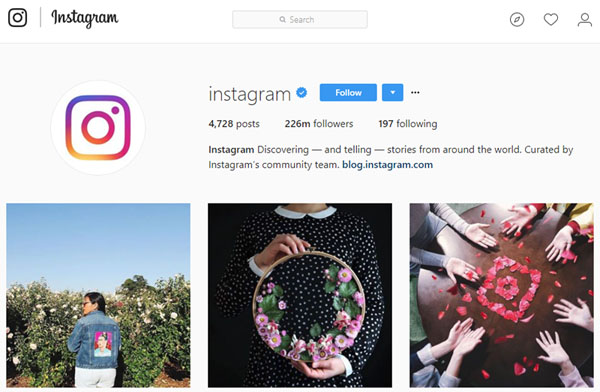

# iscrape  [](https://lifecycle.r-lib.org/articles/stages.html#experimental) 

A basic web scraper for Instagram.  Functions included in this package can retrieve the following information:

From __username__   

+ Number of posts
+ Number of followers
+ Number following

From __hashtag__  

+ Number of posts

## Installation  

Install R software for your system. Install dependency packages. Then, install `iscrape` from GitHub using `devtools`

```r
install.packages(c("devtools","dplyr","httr","stringr"),dep=T)
devtools::install_github("royfrancis/iscrape")
```

## Tutorial

### User page metrics

We will use the username "instagram" to get information from this page:
https://www.instagram.com/instagram/



Get the user webpage.

```r
library(iscrape)

# get webpage
pu <- get_page_user("instagram")
```

From the webpage, get post count, follower count and following count.

```r
get_count_post(pu)
instagram 
     4729 
     
get_count_follower(pu)
instagram 
226200000 

get_count_following(pu)
instagram 
      197 
```

Get posts, followers and following as a data.frame from a vector of usernames.

```r
get_page_info(c("instagram","travelandleisure","minimalism"))
```

```
          username posts followers following
1        instagram  6250 335800000       223
2 travelandleisure  6091   4900000       440
3       minimalism   856    249600       129
```

### Hashtag metrics

We will use the hashtag "instagram" to get information from this page:
https://www.instagram.com/explore/tags/instagram/


Get the hashtag webpage.

```r
# get webpage
ph <- get_page_hashtag("instagram")
```

From the webpage, get post count.

```r
get_count_hashtag(ph)
instagram 
171200000 
```

### Disclaimer  

Note that web scraping is discouraged by Instagram. Do not use this tool to scraping thousands of pages or it is likely that your IP address may be blocked by Instagram. Speaking of IP addresses, it might be a good idea to use a VPN when using this tool.

This package was created for personal use, but you are free to use it. The package is very simple relying on text pattern matching. This means that the code is functional at the time of writing, but future changes to Instagram page structure may cause these functions to break. This package is unlikely to be updated or maintained regularly.

***

2020 | Roy Francis
